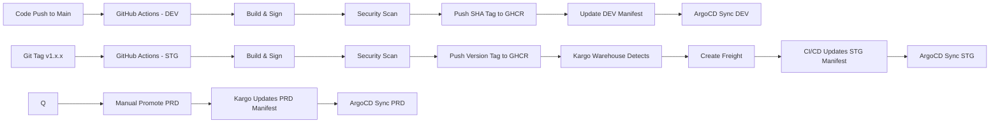

# demo-app-repo
ARGOCD+KARGO+CICD WITH PROPER DEPLOYMENT STRATEGY FOR DEV, STAGE AND PROD.

```mermaid
graph LR
    A[Code Push to Main] --> B[GitHub Actions - DEV]
    B --> C[Build & Sign]
    C --> D[Security Scan]
    D --> E[Push SHA Tag to GHCR]
    E --> F[Update DEV Manifest]
    F --> G[ArgoCD Sync DEV]
    
    H[Git Tag v1.x.x] --> I[GitHub Actions - STG]
    I --> J[Build & Sign]
    J --> K[Security Scan]
    K --> L[Push Version Tag to GHCR]
    L --> M[Kargo Warehouse Detects]
    M --> N[Create Freight]
    N --> O[CI/CD Updates STG Manifest]
    O --> P[ArgoCD Sync STG]
    
    Q --> R[Manual Promote PRD]
    R --> S[Kargo Updates PRD Manifest]
    S --> T[ArgoCD Sync PRD]
```